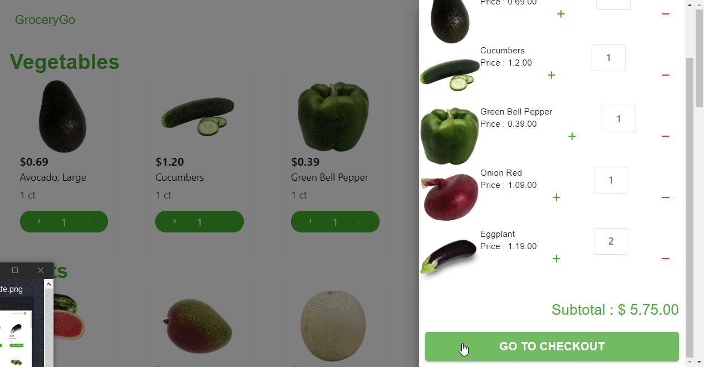

# GroceryGo - React Shopping Platform  (MERN)

GroceryGo is food delivery, grocery and local shopping platform.



## Features

- Full featured shopping cart
- Top products carousel
- Admin product management
- Checkout process (shipping, payment method, etc)
- Database seeder (products & users)

## Live Demo

[Live Demo Link](https://clone-webapp.web.app/)


## Built With

- ReactJs
- Redux
- MongoDB
- Express
- HTML
- CSS
- Heroku
- Material-UI

## Getting Started

To get local copy up and running in your local machine follow this simple step:

### Install Dependencies (frontend & backend)

```
npm install
cd frontend
npm install
```

### Run

```
# Run frontend (:3000) & backend (:5000)
npm run dev

# Run backend only
npm run server
```

### Seed Database

You can use the following commands to seed the database with some sample users and products as well as destroy all data

```
# Import data
npm run data:import

# Destroy data
npm run data:destroy
```

```
Sample User Logins

admin@example.com (Admin)
123456

john@example.com (Customer)
123456
```


## :handshake: Contributing

Contributions, issues, and feature requests are welcome!

Feel free to check the [issues page](https://github.com/juanmndz/react-ecommerce-material/issues).

## Show your support

Give a :star: if you like this project

## Acknowledgments
- [Material-Ui](https://material-ui.com/components/material-icons/) for its Awesome Icons
