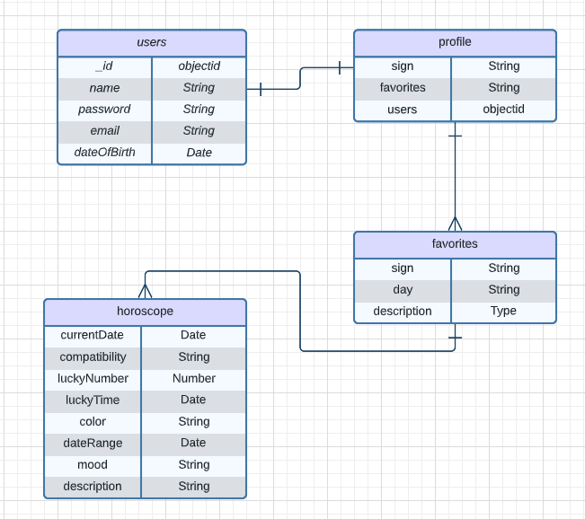
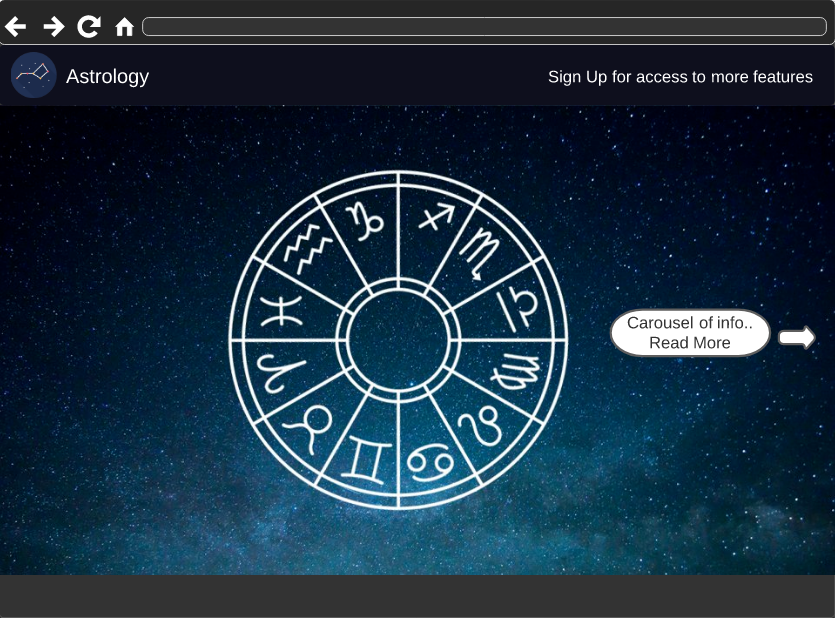
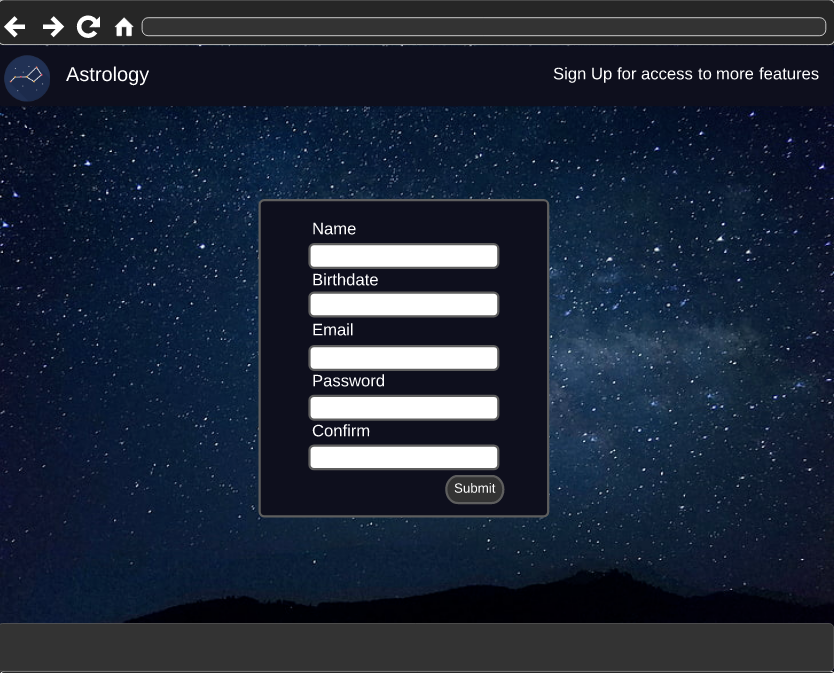
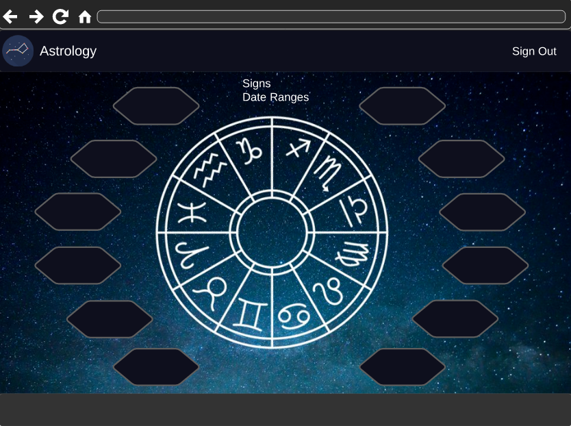
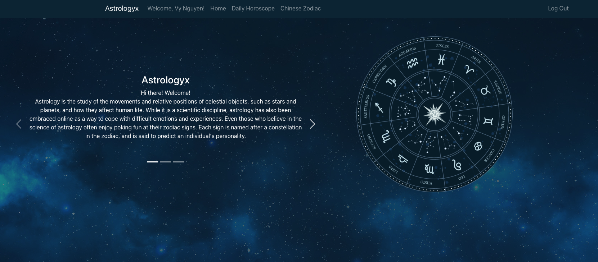
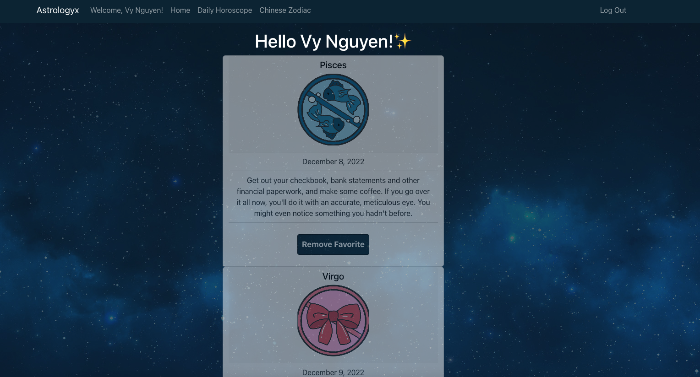
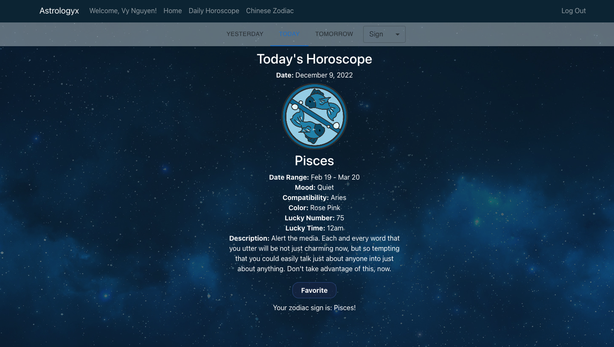
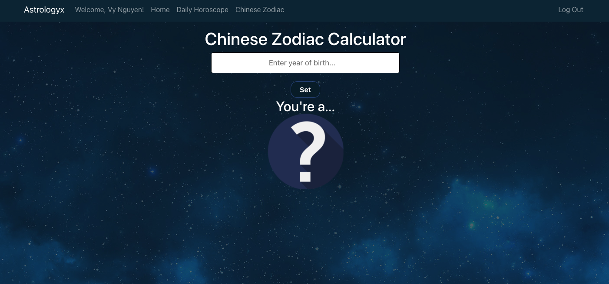

# Astrology MERN Full-Stack Application


## OVERVIEW

- The Astrology MERN Application is a full-stack application that will allow users to sign-up for more features, such as seeing a daily horoscope include yesterday's and tomorrow's, compatibility, color, mood, and many more!


### Technology

- React
- JWT
- MongoDB
- Mongoose
- Express JS
- Node JS
- HTML5
- CSS & Bootstrap
- Material UI
- JavaScript


## Entity Relationship Diagram




## USER STORIES

```
As a user, AAU, I want the ability to...
- sign up with my own personal information
- sign in and be able to see my daily horoscope
- see what sign I am based on my birthday
- navigate to see yesterday's, today's and tomorrow's horoscope
- check what my chinese horoscope is based on my birth year
- see today's mood/colors/lucky number
```


## Wireframes






## Screenshots







## INSTRUCTIONS

- Sign-up and log-in to access more features
- Logged in users can view daily horoscopes for different signs
- Chinese Zodiac calculator avaiable to input your birth year and see your sign!
- Logged in users can favorite horoscope readings into their profile page to view and delete at their convenience


## Trello Board

[Trello](https://trello.com/b/S1HsSaO4/project-3)


## Planned future enhancements

- Implement feature to give personality traits for each sign


## Credits

Wireframes and ERD was created using [Lucidchart](https://www.lucidchart.com/).
API used for this project was [aztro.](https://aztro.readthedocs.io/en/latest/)
